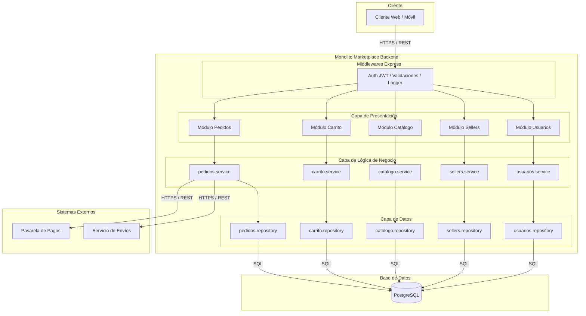

# Estilo Arquitectónico

## Descripción
Se selecciona el estilo **Monolito Modular con Arquitectura en Capas** para la estructura global del sistema[cite: 4, 8].

* **Monolito Modular:** Representa la unidad de despliegue principal en un solo proceso ejecutable[cite: 4, 9].
* **Capas Lógicas:** Divide el sistema internamente en Presentación, Lógica de Negocio y Datos[cite: 9].

## Diagrama del Estilo Arquitectónico

