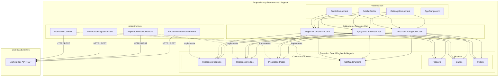

# Enfoque Arquitectónico: Clean Architecture

## Resumen del Enfoque

| Elemento | Descripción aplicada al Marketplace |
| :--- | :--- |
| **Patrón / Enfoque arquitectónico** | Clean Architecture (Arquitectura Limpia). |
| **Objetivo** | Separar responsabilidades y controlar las dependencias hacia el dominio. |
| **¿Qué problema resuelve?** | Evita el acoplamiento entre la interfaz Angular, las reglas del negocio y las tecnologías externas (bases de datos, API y servicios de pago). |
| **Capas definidas** | Presentación, Aplicación, Dominio e Infraestructura. |
| **Beneficios** | • Facilita el mantenimiento y las pruebas unitarias. • Permite cambiar implementaciones técnicas sin modificar las reglas de negocio. • Mejora la organización y separación de responsabilidades del código. |

## Diagrama de Clean Architecture (GoPet Marketplace)

